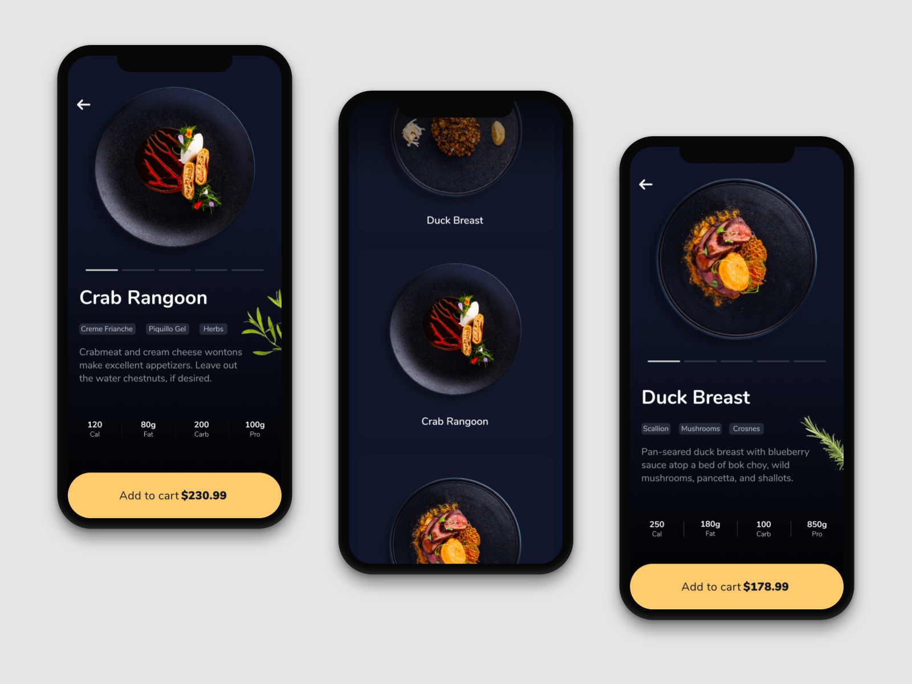

# {{title}}

---


Note: speaker notes come down here

---


Note: Food App Recipe by Afterglow

---



---

## Slide 3

> I quote...

---

## Slide 4

I've also got some `code()`; even some code blocks:

```
var x = 0;
var y = 1;

var z = x * y;
```

---

## Slide 5

- Fragments
  <!-- .element: class="fragment" -->
- also works
  <!-- .element: class="fragment" -->
