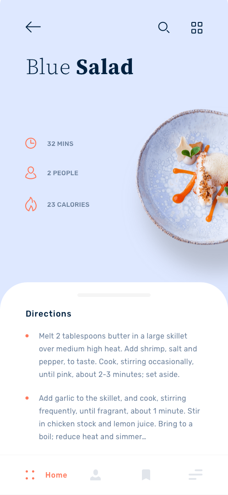

# {{title}}

---

# 192.168.1.152:3000

---

---

---

---

---

---

---

---

---

---

---

---

- Fragments
  <!-- .element: class="fragment" -->
- also works
  <!-- .element: class="fragment" -->
